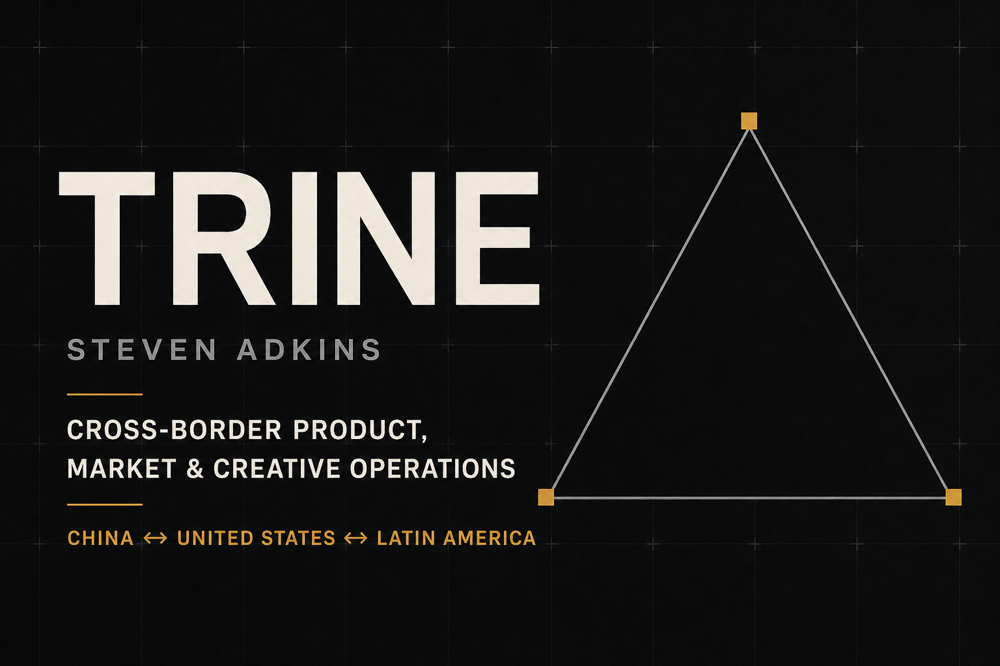

# Trinefield

[**View the live portfolio →**](https://trinefield.com)

Trinefield is Steven Adkins' multilingual professional portfolio for product building, AI-assisted workflows, operations, customer experience, UX/UI, content, and creative execution.



## What this project demonstrates

- Product positioning and information architecture for a multidisciplinary professional profile
- Responsive UX across desktop, mobile, and embedded social browsers
- A cinematic Three.js environment with scroll-driven motion and pointer interaction
- Automatic WebGL capability detection with a lightweight metallic 2.5D fallback
- Adaptive performance for integrated graphics, touch devices, and reduced-motion preferences
- English, Spanish, and Simplified Chinese content architecture
- Interactive collaboration sections, direct contact routes, and a privacy-conscious inquiry form
- Browser-based introduction and résumé experiences with printable and downloadable formats
- Custom favicon, social sharing metadata, and a production custom domain

## Technology

- Next.js and React
- TypeScript
- Three.js and React Three Fiber
- GSAP and ScrollTrigger
- CSS responsive design and progressive enhancement
- Vinext, Vite, and Cloudflare-compatible deployment output
- Node test runner and ESLint validation

## Rendering approach

The main experience progressively enhances according to the visitor's device:

1. Supported desktop browsers receive the full WebGL scene.
2. Touch devices, reduced-motion users, and browsers without a stable graphics context receive an art-directed 2.5D version using the same textures, lighting, triangle system, and depth cues.
3. If a WebGL context is lost, the site falls back cleanly instead of interrupting the portfolio.

This keeps the visual identity consistent while protecting mobile performance, accessibility, and browser compatibility.

## Languages and professional documents

Public-facing copy is maintained in standalone language dictionaries:

- `src/content/translations/en.ts`
- `src/content/translations/es.ts`
- `src/content/translations/zh-CN.ts`

The site also includes:

- `/introduction` — a concise professional overview
- `/resume` — a translated web résumé
- `/steven-adkins-master-resume.pdf` — the original English résumé

## Run locally

Node.js 22.13 or newer is recommended.

```bash
npm install
npm run dev
```

The development server prints the local preview address. To validate a production build:

```bash
npm run lint
npm test
```

## Configuration and security

Secrets are never stored in the repository. Local `.env` files, Cloudflare development variables, package-manager credentials, private keys, service-account files, and deployment archives are excluded through `.gitignore`.

The optional contact-email delivery path expects hosting-provider environment variables such as:

```text
RESEND_API_KEY=
CONTACT_TO_EMAIL=
CONTACT_FROM_EMAIL=
NEXT_PUBLIC_SITE_URL=
```

When email delivery is not configured, the interface offers the visitor a prepared email draft instead of claiming that a message was delivered.

## Project structure

```text
app/                     Routes, page UI, metadata, and contact endpoint
src/components/          Locale and cinematic rendering components
src/content/             Site configuration, résumé data, and translations
public/                  Brand assets, textures, documents, and social preview
tests/                   Rendered-output and content integrity checks
worker/                  Cloudflare-compatible application entry point
```

## Project status

Trinefield is live and actively evolving. The repository documents the product, UX, creative, localization, and front-end engineering decisions behind the published portfolio.

© Steven Adkins
